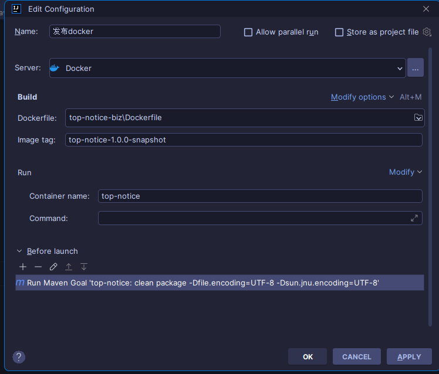
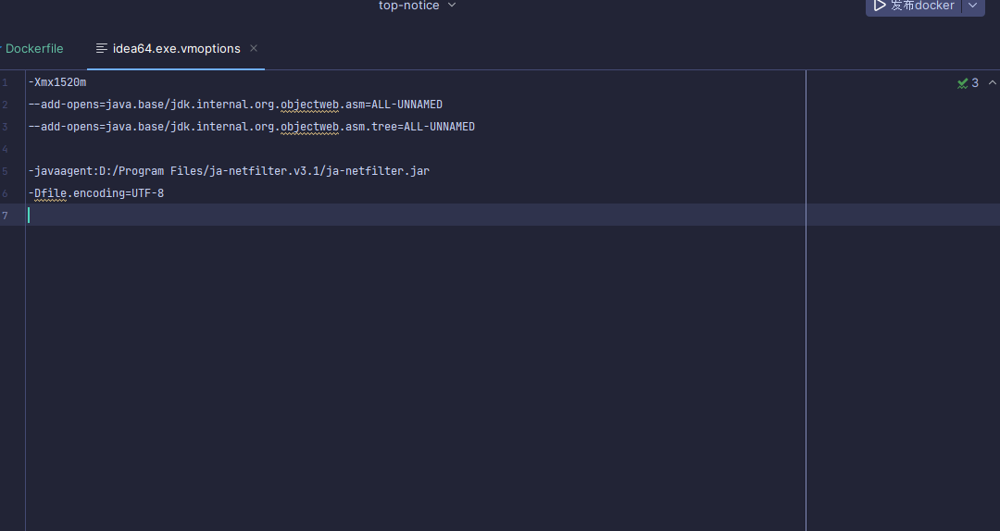

# Dockerfile 编写
```angular2html
FROM adoptopenjdk/openjdk8
ADD target/top-notice-biz.jar app.jar 

ENV TZ Asia/Shanghai
RUN ln -snf /usr/share/zoneinfo/${TZ} /etc/localtime && echo ${TZ} > /etc/timezone

EXPOSE 8888
ENTRYPOINT [ "java", "-Djava.security.egd=file:/dev/./urandom", "-jar", "/app.jar" ]

```
      target 后面对应的package 之后的报名也可以用*.jar,但是有可能会会
    出现多个jar,找不到的错误
# idea 配置docker镜像

- image Name : 配置镜像名称
- container Name : 配置容器名称
- before launch: `clean package -Dfile.encoding=UTF-8 -Dsun.jnu.encoding=UTF-8`
 
# springboot 
`springboot 不需要任何的更改`
# idea docker 控制台乱码问题 


`-Dfile.encoding=UTF-8`
