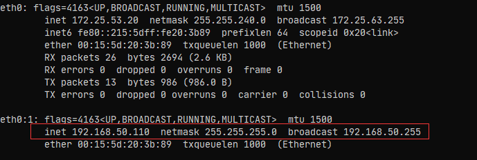
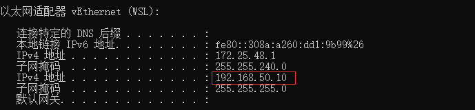
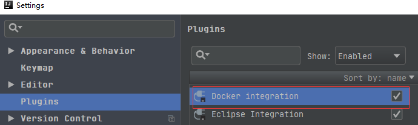
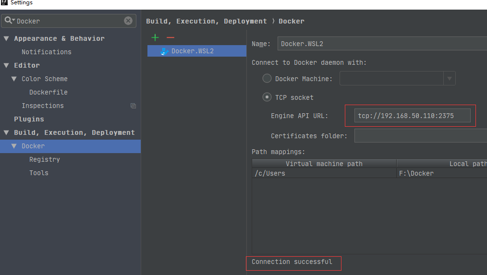
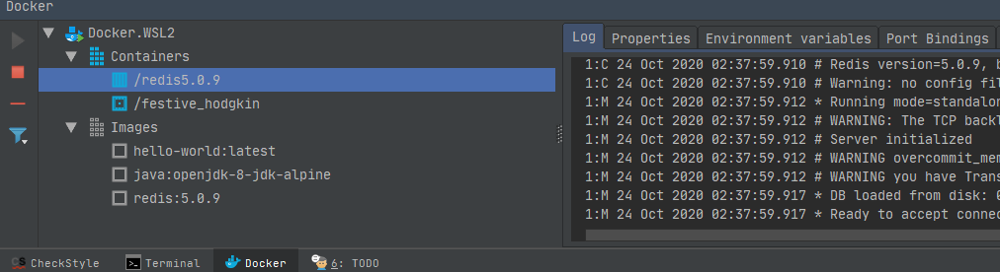

# wsl2 设置固定ip
 wsl2 每次启动都生不同的ip,需要固定ip
```angular2html
@echo off
setlocal enabledelayedexpansion

::不管三七二十一先停掉可能在跑的wsl实例
wsl --shutdown ubuntu
::重新拉起来，并且用root的身份，启动ssh服务和docker服务
wsl -u root service ssh start
wsl -u root service docker start | findstr "Starting Docker" > nul
if !errorlevel! equ 0 (
    echo docker start success
    :: 看看我要的IP在不在
    wsl -u root ip addr | findstr "192.168.120.181" > nul
    if !errorlevel! equ 0 (
        echo wsl ip has set
    ) else (
        ::不在的话给安排上
        wsl -u root ip addr add 192.168.120.181/24 broadcast 192.168.120.0 dev eth0 label eth0:1
        echo set wsl ip success: 192.168.120.181
    )


    ::windows作为wsl的宿主，在wsl的固定IP的同一网段也给安排另外一个IP
    ipconfig | findstr "192.168.120.100" > nul
    if !errorlevel! equ 0 (
        echo windows ip has set
    ) else (
        netsh interface ip add address "vEthernet (WSL)" 192.168.120.100 255.255.255.0
        echo set windows ip success: 192.168.120.100
    )
)
pause  

//脚本只适用与ubuntu子系统
```
设置开机每次都运行这个脚本,这样wsl2的linux子系统和window系统在同一个ip段


设置固定IP之后,访问wsl只需要使用固定ip即可,不需要知道wsl 随机生成的ip是什么
# idea 安装docker 插件

为了idea的docker 插件能连接到wsl 的docker ,需要打开wsl的docker 2375端口远程访问,编辑/etc/default/docker
修改如下配置:
```angular2html
#开启远程访问 -H tcp://0.0.0.0:2375
#开启本地套接字访问 -H unix:///var/run/docker.sock
DOCKER_OPTS="-H tcp://0.0.0.0:2375 -H unix:///var/run/docker.sock"
```
重启docker进程:
```angular2html
sudo service docker restart
```
在IDEA配置Docker远程连接，Build->Docker，配置对应WSL的IP即可连接Docker，如下图:

连接Docker之后就可以查看和管理Docker镜像和容器, 如下图:

