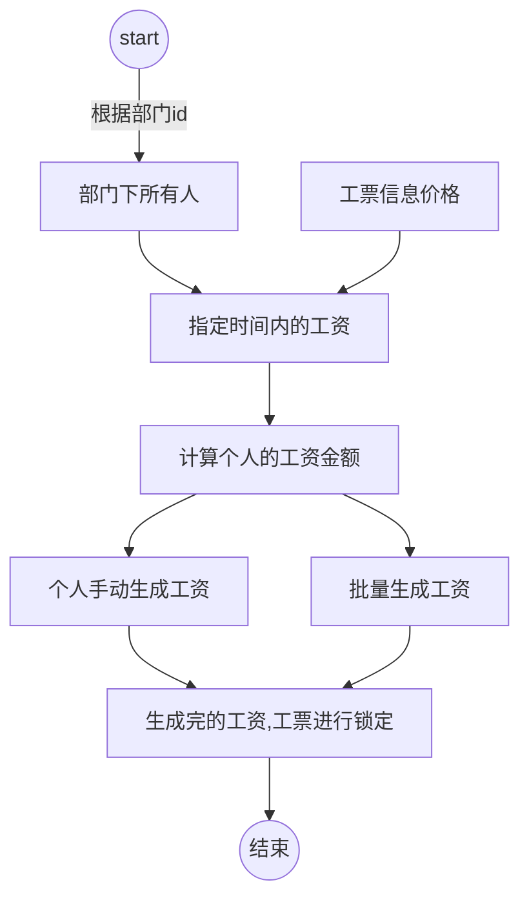
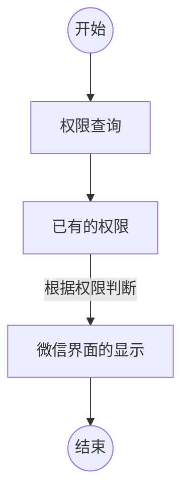

## 工资计算

## 服装小程序权限控制不同的功能 

## 工资计算表设计

| 字段名     | 字段类型 | 默认值   | 备注         |
| ---------- | -------- | -------- | ------------ |
| id         | int      | not null     | id           |
| start_date | date     | not null | 计算开始日期 |
| end_date   | date     | not null | 计算结束日期 |
| dept_id    | int      | not null | 部门id       |
| user_id    | int      | not null | 人员id       |
| money      | int      | not null | 人员工资     |

## 工序的价格

| 字段名     | 字段类型 | 默认值   | 备注         |
| ---------- | -------- | -------- | ------------ |
| id         | int      | not null | id           |
| style      | int      | not null | 样式类型     |
| price      | int      | not null | 价格         |
| start_date | date     | not null | 计算开始日期 |
| end_date   | date     | not null | 计算结束日期 |

## 中间表，部门下的人员指定时间段的工序(暂时考虑要不要添加)

- 生成之前，之前的总价格是固定的，除非将本时间段的工资取消结算
- 工资锁定的规则，锁定上个已结工资的价格
- 当前的价格的概念，本时间段已经生成的结算工资，并且重新生成一个时间段的工序价格
- 工序价格是区间价格
- 工资的结算也是区间的数据

## 总体查看工资条
- 列表多个人，展示人员时间时间段的工资，点击进去查看计算的详情
## 个人查看工资条
- 个人时间段工资详情