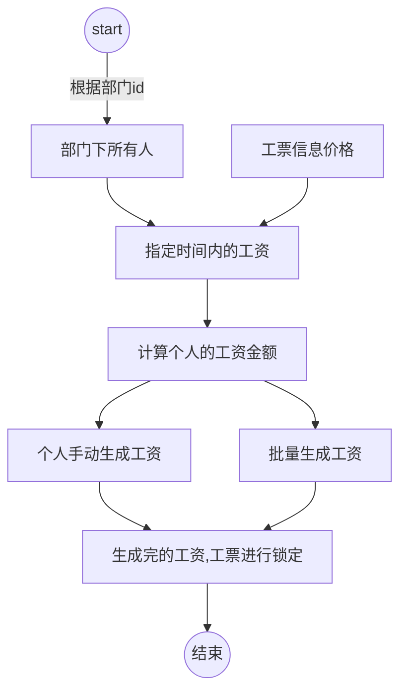
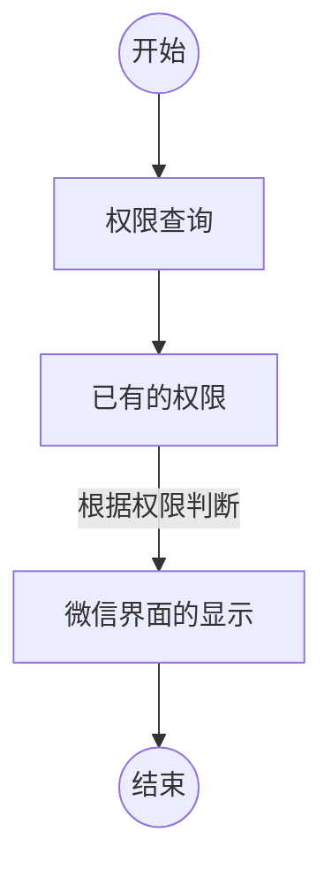

## 工资计算

```mermaid
graph TB
开始((start)) --根据部门id--> 部门下所有人
部门下所有人 --> 指定时间内的工资
工票信息价格 --> 指定时间内的工资
指定时间内的工资 --> 计算个人的工资金额
计算个人的工资金额 --> 批量生成工资
计算个人的工资金额 --> 个人手动生成工资
个人手动生成工资 --> 生成完的工资,工票进行锁定
批量生成工资 --> 生成完的工资,工票进行锁定
生成完的工资,工票进行锁定 --> 结束((结束))
```

## 服装小程序权限控制不同的功能 

```mermaid

graph TB
开始((开始)) --> 权限查询
权限查询 --> 已有的权限
已有的权限 --根据权限判断--> 微信界面的显示
微信界面的显示 --> 结束((结束))
```