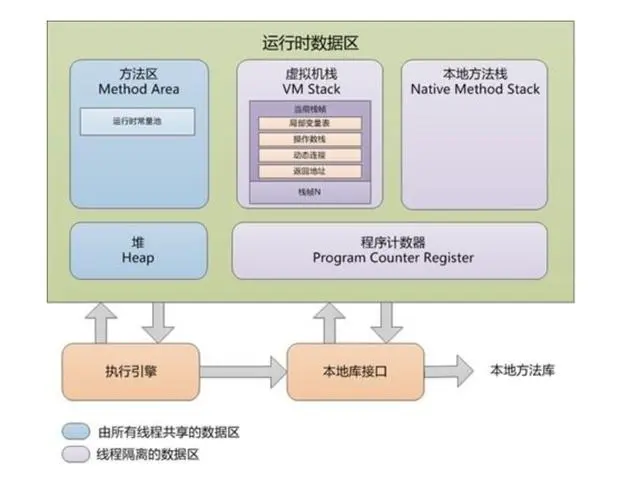
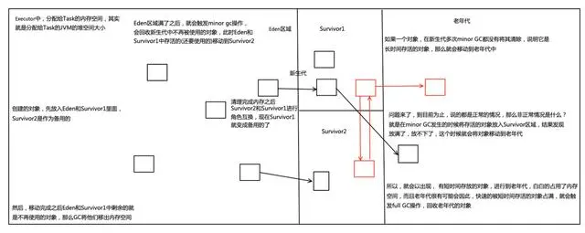

##  栈(JVM Stacks)
- 存放局部变量(定义再方法中的变量和定义在方法参数列表上的变量),
  对象引用(reference 类型,它不等于对象本身,根据不同的虚拟机
  实现,它可能是一个指针对象地址的引用地址,也可能指向一个代表对
  象的句柄或者其他参与此对象的位置),方法执行
- 栈里面的变量不会附初始值
- 是线程的私有的,它的生命周期与线程相同,线程之间资源不共享,虚
  拟机栈描述的是java方法执行的内存模型:每个方法被执行的时候都
  会同时创建一个栈帧(Stack Frame) 用于存储局部变量表,操作栈,
  动态链接,方法出口等信息.每个方法被调用直至执行完成的过程,就对
  应着一个栈帧在虚拟机中从入栈到出栈的过程
- 栈是一块连续的空间,相比堆来说比较小,运行速度快,不需要垃圾回收
  机制
- 在java虚拟机规范中,对这个区域规定了两种异常状况:
  - 如果线程请求的栈深度大于虚拟机所允许的深度,将抛出
    StackOverFlowErr异常
  - 如果虚拟机栈可以扩展(当前大部分的java虚拟机都可以扩展,只不
    java虚拟机规范中也允许固定长度的虚拟机栈),当扩展无法申请到
    足够的内存时抛出OutOfMemoryError异常

- 堆
  - 是java虚拟机索管理的内存中最大的一块,被所有线程共享(前提是
    要地址),在虚拟机启动时创建
  - 此内存区域的唯一的目的就是放在对象实例(new的对象)并非附初
    始值,空间最大,运行速度最慢,需要垃圾回收机制.在实现时,既可
    以实现固定大小的,也可以扩展的,不过当前主流的虚拟机都是可以
    扩展来实现的(通过-Xmx和-Xms控制).
  - 如果在堆中没有内存完成实例分配,并且堆也无法再扩展时,将非抛出
    outOfMemoryError异常
  - 当堆中没有变量指向时,堆中的变量就会被回收
  - 对象的实体基本都存储在堆中,外界只能通过地址引用堆里面的对象
    从结构上来分,堆可以为新生代和老年代.而新生代又分为Edon空间,
    from survivor空间(s1), to survivor 空间(s2):
  
  
  - 内存分为新生代和老年代
  
