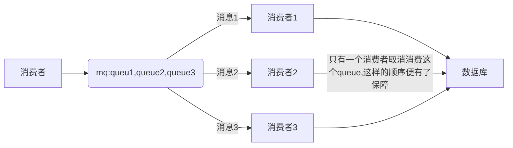
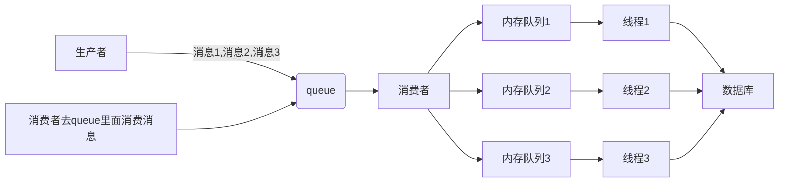

# rabbitmq如何保证消费的顺序性

## 1.1保证顺序性的意义

消息队列中的若干消息如果是针对同一个数据进行操作,这些操作具有前后的关系.必须要按照前后的顺序执行,否则会造成数据异常,举例:

比如mysql binlog进行两个数据同步,由于对数据库的数据操作是具有顺序性的,如果操作顺序搞反,就会造成不可估量的错误.比如数据库对某一条数据依次执行了`<mark>`插入`</mark>`,`<mark>`更新`</mark>`,`<mark>`删除`</mark>`的操作,这个顺序必须这样的.如果同步的过程中,消息的顺序变成了`<mark>`删除`</mark><mark>`更新`</mark><mark>`插入`</mark>`,那么原来应该删除的数据,就没有被删除的数据,造成数据不一致的问题.

## 1.2 出现顺序错误的场景

我们还是已rabbitmq为例

### 1.2.1 错乱的场景1

一个queue,有多个消费者,这样就会出现顺序错乱,consumer从mq里面读取数据是有序的,但是每个consumer的执行时间是不固定的,无法保证先读先处理,这样就会出现消息没有按照顺序执行,造成数据顺序的错误.

```mermaid
graph LR;
生产者--消息3--消息2--消息1--> queue
queue--消息1-->消费者1
queue--消息2-->消费者2
queue--消息3-->消费者3
消费者1--由于不同的消费者处理数据的速度不一样,消费者2首先处理完,这样消费者2就优先处理-->数据库
消费者2-->数据库
消费者3--原本者三个操作应该是顺序的,结果顺序丢失,造成数据混乱-->数据库
```

### 1.2.2 错乱场景2

一个queue,对应一个consumer,但是consumer里面进行了多线程消费,这样的消息消费也会出现错误.

```mermaid
graph LR;
生产者--消息3--消息2--消息1--> queue
queue-->消费者
消费者-->线程1
消息1-->线程1
消费者-->线程2
消息2-->线程2
消费者-->线程3
消息3-->线程3
线程1--消费者内部使用多线程去消费消息,由于不同的消息处理的数据库顺序不一样,线程2优先执行,这样消息2还是先处理-->数据库
线程2-->数据库
线程3--原来这三个操作应该是有顺序的,结果顺序丢失,造成数据混乱-->数据库
消息1-->数据库
消息2-->数据库
消费3-->数据库
```

## 1.3 保证消息的消费顺序

### 1.3.1 解决方案一

拆分成多个queue,每个queue一个consumer,就是多一些queue而已,确实也是麻烦点;这样也会造成吞吐量下降,可以在消费者内容采用多线程的方式去消费.



### 1.3.2 解决方案二

或者就是一个queue,但是对应一个consumer,然后这个consumer内部用内存队列作为队列,然后分发给底层不同的worker来处理


