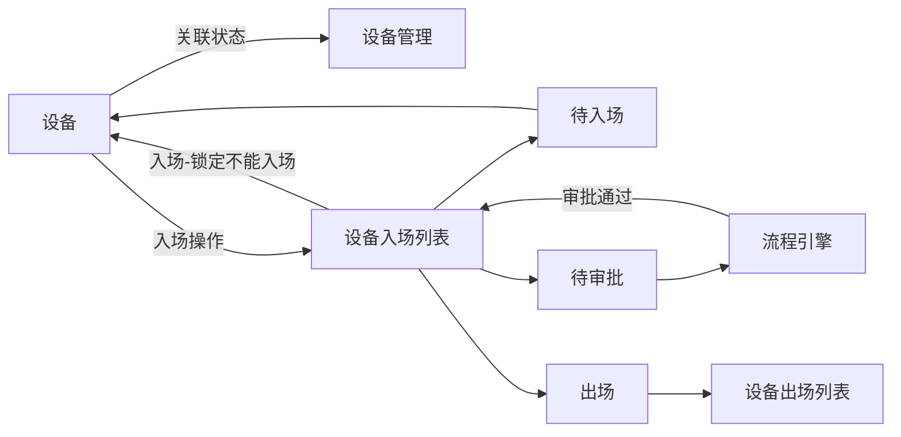

# 设备管理
## 分支
top-system: fix:设备管理
## sql
```sql
create table equipment_mobilization_file
(
    equipment_mobilization_id varchar(64)       null comment '设备管理id',
    url                       varchar(200)      null comment '附件url',
    type                      tinyint default 0 not null comment '0.入场,1.出场'
)
    comment '设备管理附件';

create index index_equipment_mobilization_id
    on equipment_mobilization_file (equipment_mobilization_id)
    comment '设备管理索引';

alter table equipment_mobilization
             add audit_status int null comment '审批状态 0.待审批 1.审批中 2.拒绝 3.撤销 4.通过 5.作废 6.结束'

create table equipment_mobilization_out
(
    contract_id            varchar(100) not null comment '合同ID',
    subject_id             varchar(100) null comment '公司主体ID',
    contract_name          varchar(100) null comment '合同名称',
    create_time            timestamp    null comment '创建时间',
    creator                varchar(100) null comment '创建人',
    equipment_id           bigint       null comment '设备ID',
    equipment_name         varchar(100) null comment '设备名称',
    equipt_admission_time  timestamp    null comment '设备入场时间',
    equipt_appear_time     timestamp    null comment '设备出场时间',
    id                     varchar(64)  not null comment 'id'
        primary key,
    last_modifier          varchar(100) null comment '最新修改人',
    last_update_time       timestamp    null comment '最新修改时间',
    project_id             varchar(100) null comment '项目ID',
    project_name           varchar(100) not null comment '项目名称',
    status                 tinyint      not null comment '状态(1:入场,2:未入场)',
    sensor_associat_status varchar(10)  null comment '传感器关联状态',
    batch                  varchar(100) null comment '批次',
    audit_type             int          null comment '审批状态 0.待审批 1.审批中 2.拒绝 3.撤销 4.通过 5.作废 6.结束',
    process_id             varchar(64)  null comment '流程id',
    assignee_id            varchar(64)  null comment '审批人id',
    assignee_name          varchar(100) null comment '审批人姓名',
    process_initiator_name varchar(100) null comment '流程初始化人名称',
    process_initiator_id   varchar(64)  null comment '流程初始化id',
    process_def_id         varchar(100) null comment '流程定义id',
    constraint idx_equipment_mobilization_1
        unique (subject_id, equipment_id)
)
    comment '设备出场';
```
## 流程图
