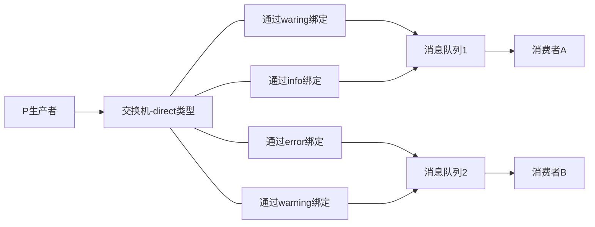
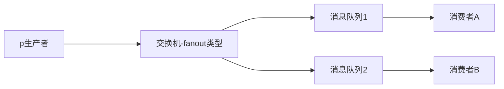
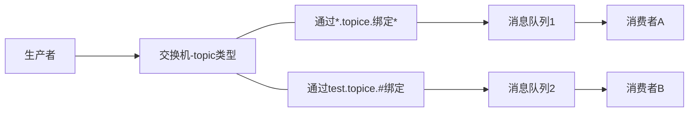

# rabbitmq的四种类型交换机

- direct exchange 直接交换机
- fanout exchange 扇出交换机
- topic exchange 主题交换机
- header exchange 头交换机

## direct exchange 直接交换机

直接交换机的特点是消息队列通过rountingKey与交换机进行绑定,相同的routingKey会获取相同的消息,一个队列可以通过多个不同的routingKey与交换机进行绑定,不同的队列也可以通过不同的routingKey绑定交换机.

## fanout exchange 扇出交换机

扇出交换机的特定是类型广播,只要队列与该类型的交换机绑定,所有发送的信息都会被发到所有与之绑定的队列,与routingKey无关.

## topic exchange 主题交换机

应用范围最广泛交换机类型,消息队列通过消息主题与交换机绑定,多个消息队列也可以通过相同的消息主题和交换机绑定,并且可以通过通配符(*或#)进行多个信息主题的适配.

消息主题的一般格式为xxx.xxx.xx(x为英文字母,每个单词用英文句号分隔),*通配符可以适配一个单词,#可以适配零个或者多个单词.

适配符如下:*.xxx.#. 此主题可以适配xxx前面只有一个单词后面零个或者多个单词的消息主题.

## header exchange

与routingKey无关,匹配机制是匹配消息头中的消息.在绑定消息队列与交换机之前声明一个map键值对,通过这个map对象消息队列和交换机的绑定,当消息发送到rabbitmq时会到该消息的header与exchange绑定时指定的键值对进行匹配,如果完全匹配消息会路由到该队列,否则不会路由到该队列.

x-match=all:表示所有的键值对都匹配才能接受到消息

x-match=any:表示只要是键值对匹配就能接受到消息

