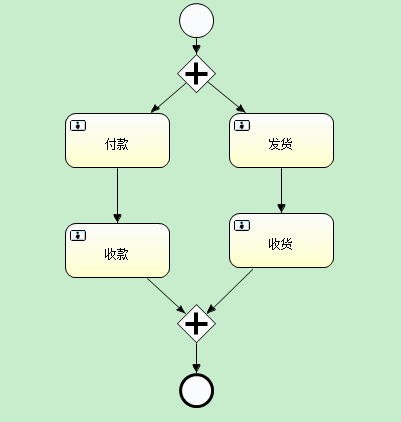

# activity 网关
- 并行网关:用于创建并行路径,同时执行多条分支。
- 包容网关:用于汇聚并行分支路径,继续后续的活动。
- 排他网关:用于创建互斥的选择路径,只能选择一条分支继续执行。
-  inclusive网关:用于创建包含选择路径,可以选择一条或多条分支继续执行。
- 事件 bassed网关:基于接收的消息或事件来选取一条或多条继续执行的分支。
  并行网关和包容网关用于实现流程的并行执行。排他网关和inclusive网关用于实现基于条件的选择路径。事件bassed网关基于外部事件来选取路径。

## 并行网关
并行网关的主要特征是:
1. 同时激活多条输出分支,实现流程的并行执行。
2. 多个输出分支可以汇聚在同一个包容网关,也可以分别汇聚在不同的包容网关。
3. 同一级的输出分支具有同等的优先级,没有先后顺序之分。
4. 当某一条输出分支完成时,并行网关不会结束,它会持续激活其他未完成的输出分支。
5. 只有当所有输出分支都完成时,并行网关才会结束。
   并行网关在业务流程中实现并行功能,常见的应用场景有:
1. 同时启动多个活动或子流程:如在采购流程中同时发起选定供应商和采购申请两个工作流。
2. 基于条件决定激活哪些输出分支:如在客户调查流程中根据客户类别同时启动多个问卷调查工作流。
3. 等待多个异步响应:如在申请流程中同时发起olip审批和财务审批,等待所有审批结束后继续后续工作流。
   一个简单的并行网关示例如下:
   ![并行网关示例]
   在这个例子中,流程从开始事件流转到并行网关,并行网关同时激活三个输出分支:
- 分支1:执行活动A
- 分支2:执行子流程I
- 分支3:执行活动B和活动C
  这三个分支可以并行执行,并行网关会一直持续激活,直到所有三个分支都完成,然后流程才可以从包容网关流转到活动D。
  所以并行网关是实现流程并行功能的关键元素,熟练掌握并行网关的用法和特征可以设计出更加复杂和灵活的业务流程。
## 包容网关
包容网关的主要特征是:
1. 它有多个输入分支,来自并行网关的输出分支。
2. 它会等待所有输入分支都完成,然后合并输入分支继续后续的活动。
3. 如果其中某个输入分支被中断,包容网关也会中断,等待其他分支完成。
4. 只有当所有输入分支都完成时,包容网关才会结束,继续后续活动。
包容网关在业务流程中主要用来:
1. 合并并行网关的输出分支,继续共同的后续活动。
2. 同步等待多个并行工作流或活动的完成,然后继续流程。
   一个简单的例子如下:
   
   在这个例子中:
1. 流程从开始事件来到并行网关,并行网关同时激活三个输出分支。
2. 三个输出分支分别执行活动A、子流程I和活动B+C。
3. 三个分支完成后,流程汇聚在包容网关,包容网关等待所有输入分支完成,然后结束。
4. 流程从包容网关继续,执行后续的活动D。
   包容网关用于汇聚并行网关创建的并行路径,它同步等待所有输入分支的完成,所以是实现复杂流程的关键元素之一。熟练掌握包容网关可以帮助我们设计出高效且易于控制的业务流程。
   并行网关和包容网关一起使用,可以实现流程的并行执行和路径的合并同步,是业务流程建模中最基本和最重要的部分。理解它们的特征和用法对学习BPMN规范和掌握流程建模技能至关重要。